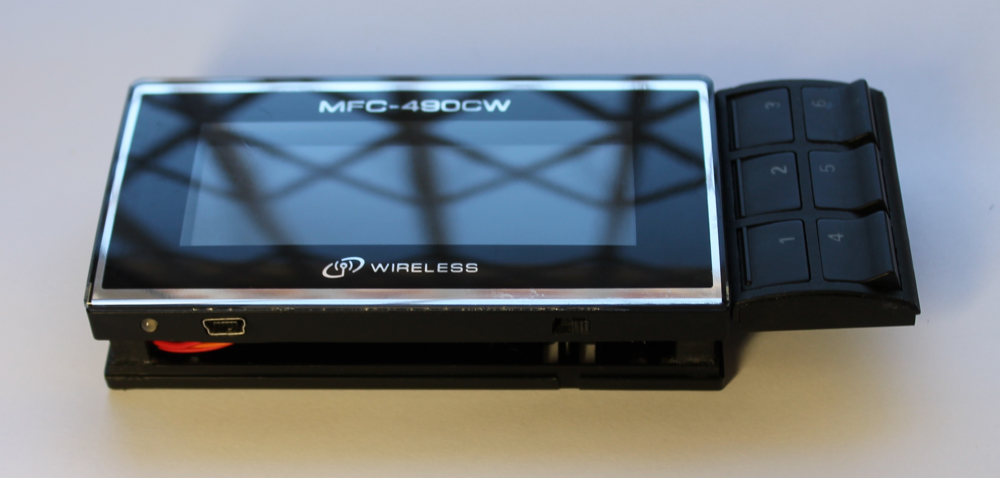

  
# Display-Brother
Reverse engineering a display

I had a brother printer, a color display and such, with a dismal flatcable communicating at a speed of +-4MHz... without a logic analyzer, it would be impossible to do anything to understand the protocol. Information on the net is non-existent, however the service manual is always better than nothing.
I got an AL for 200 bucks for this, I still use it.

It took me a long time to make this game, I didn't use any library and the code (Bascom AVR) is in a single file.
With the gathering of information, readings and tests, the files grew, ending up in 3,183 files.
After programming, 33 versions were needed, and now there are no apparent bugs.

These were the reasons why I haven't shared the code and other information yet (besides my pc having crashed), if I'm going to share something, I'd like it to make sense for those who are going to read it, and not a bunch of files.

Both the resolution and the quality reproduced on the display are low, however sufficient for many applications.

I started with an M8515 because it has more IOs, making it possible to connect to a PC's parallel port to exchange information.
All 120ohm resistors were soldered just as a precaution in the tests, there being no need to keep them after confirmation of communications.

The number of connections was reduced to a minimum, sometimes joining some, it was possible to connect it to a common m328 leaving 2 ADC pins available.

A lot of information about commercial displays and mobile phones circulates on the internet, I appreciate whoever recovers unused equipment for other purposes, this was one more challenge and a learning curve, since the expenses far exceed the value of a commercial display.

*Stay creative
